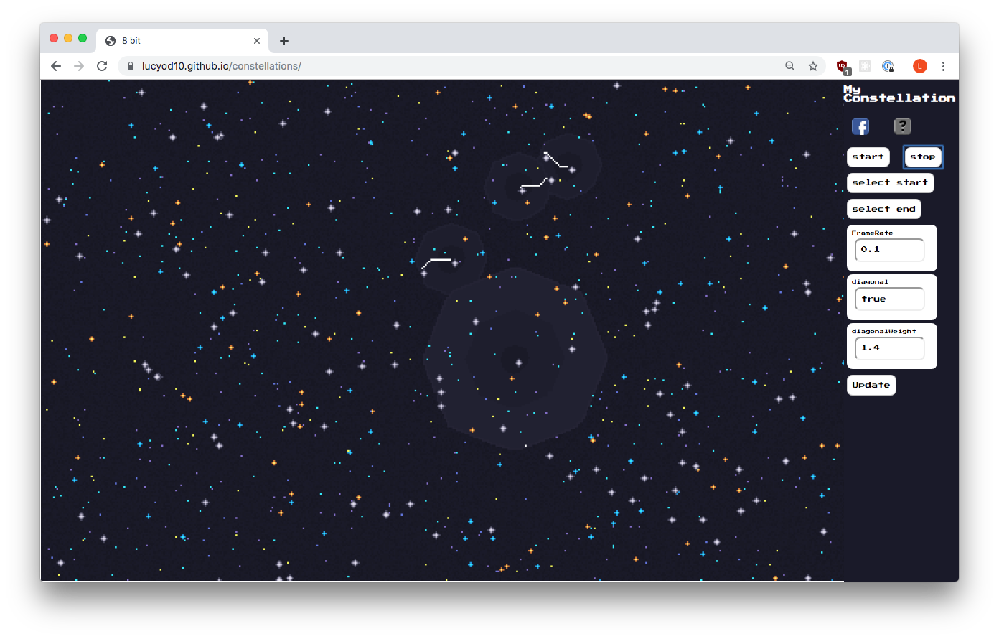
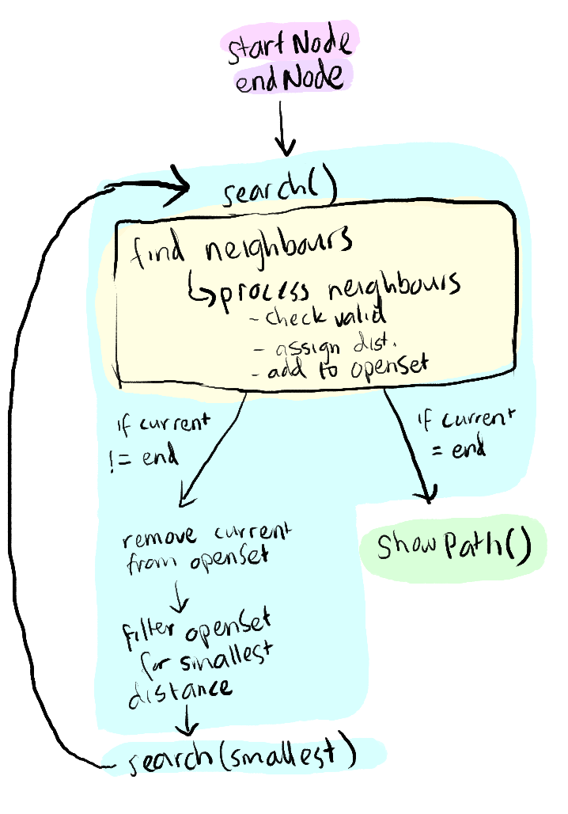

# My Constellation

This is a visualisation of the Dijkstra Algorithm in the form of an 8-Bit starry night sky.

[This is a link to the original algorithm](https://lucyod10.github.io/constellations/)

[This is a link to the bidirectional algorithm](https://lucyod10.github.io/constellations/bidirectional.html)

## How To

- Select how you would like your stars to be generated:
  - Facebook: login to facebook and see your friends represented in star form
  - Random: Randomly generate a number of stars.
- Select the first star, then the last star.
- When you click start, the search algorithm will bloom out, searching for the shortest path.
- When a path is found, the bloom finishes and a white path will be visualised between the two stars.

## Features

- I have exposed some parameters to experiment with:
  - Framerate
  - Diagonal: whether diagonal neighbours are calculated in the algorithm- this affects the path shape.
  - Diagonal Weight: if diagonal is true, then the diagonal weight is the distance that a diagonal neighbour will add. This changes the shape of the bloom, and will also affect the path shape because it is changing the distance of diagonal nodes hence the shortest path will be different.

## Dijstra Algorithm

This is a diagram of how I implemented the algorithm:

